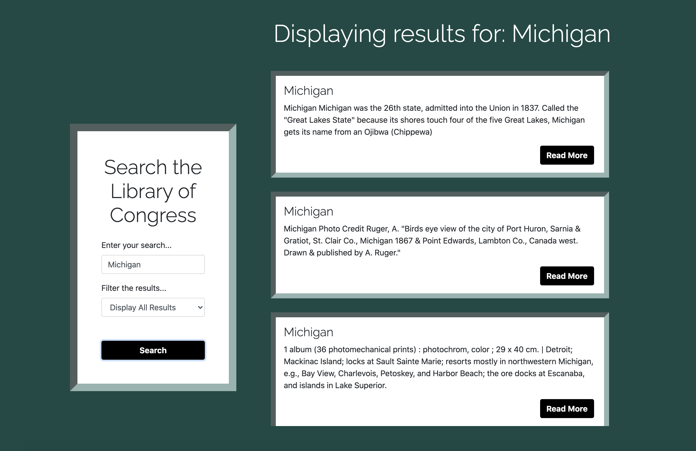

# Library of Congress Search Engine

A front-end website with a clean, responsive UI that fetches and displays data from the Library of Congress API. 

## Description

This website utilizes various front-end technologies and libraries, including HTML5, CSS3, Bootstrap, and JavaScript. Users can enter specific search queries and filter their results based on acceptable formats that the Library of Congress API includes. The user is then taken to a new page with displayed data for their specific search, and then the user can make subsequent searches if desired. 

Creating this project helped me reflect more about how to create a clean and professional user interface, and I loved using the box-shadow effect to add more dimension to the home page. I also enjoyed learning about a new way to handle displaying data from a third-party API: calling a function several times (based on the amount of data to display) and passing the needed information to the function. I find that approach to be a smart and simple way to keep the functions that fetch and display data separate.

A couple ideas for future development include:

- Including more data from the LOC API (i.e. dates, authors, keywords, etc) for more interesting search results
- Saving a user's previous searches

## Technologies Used

- HTML5
- CSS3
- Bootstrap
- JavaScript

## Table of Contents

- [Installation](#Installation)
- [Usage](#Usage)
- [License](#License)
- [Contributing](#Contributing)
- [Tests](#Tests)
- [Questions](#Questions)
            
## Installation

The application can be viewed live here:

No installation steps are necessary.

A view of the home page:

A view of a sample search:

## Usage

This application is intended for searching the Library of Congress API.

## License

This project has not yet been licensed, and thus, standard copyright laws apply.
            
## Contributing

Valerie Russell is the sole contributor to this project.
            
## Tests

There are currently no tests written for this project.
            
## Questions

If you have any questions about this application my GitHub username is vruss14 and you can view my GitHub profile at https://github.com/vruss14.

If you have additional questions, feel free to reach out to me at vruss14@gmail.com.

